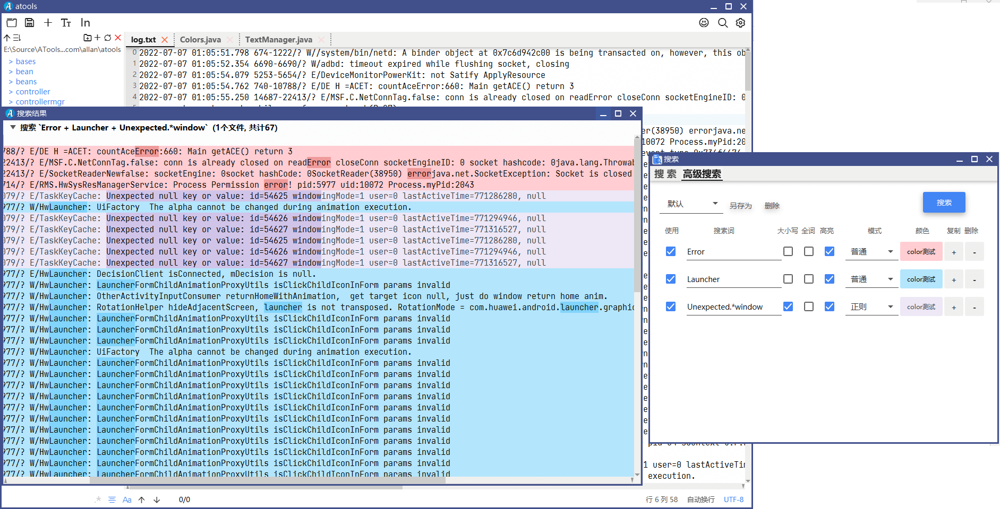
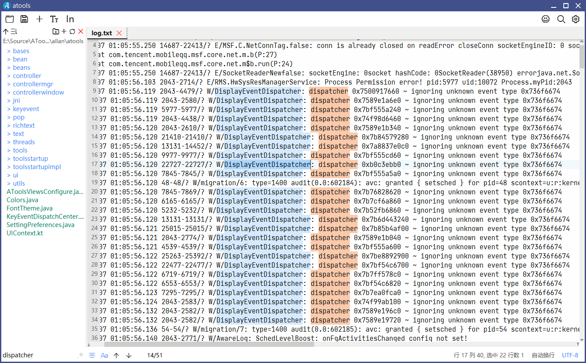
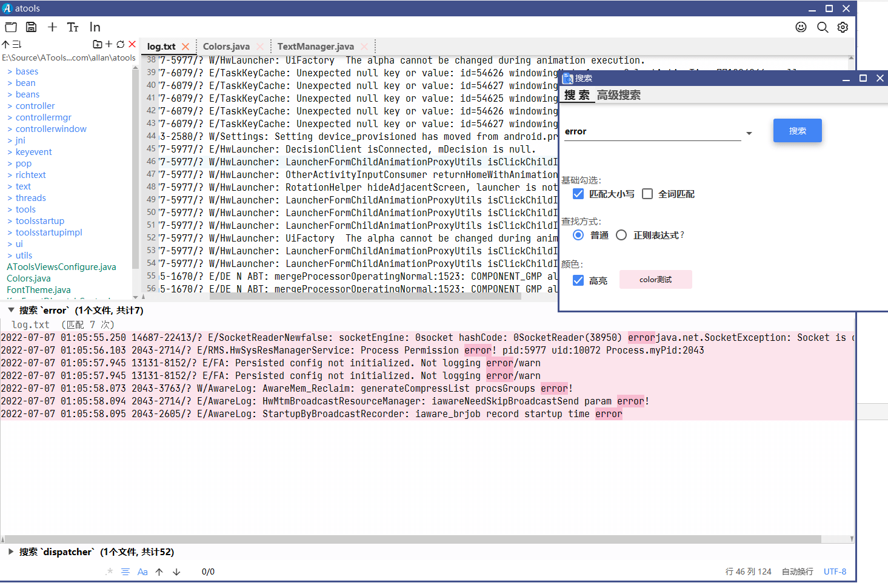
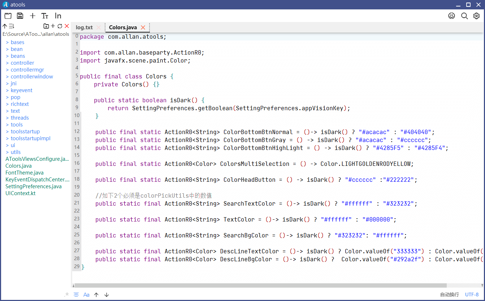

## Notepadmm 

[English ReadME](https://github.com/jzlhll/Notepadmm/blob/main/readme_en.md)

> 因在mac上缺乏notepad++的搜索多行功能的文本软件，于是一怒之下，使用javafx18 + JDK17 + richtextfx + jfoenix + kotlin等开源软件研发而成。取名为notepad--。能够支持大文件的打开。

安装包采用最新的jpackage打包。mac软件大小仅为38MB。理论支持所有常见系统。

:smile: 支持windows；

:smile: 支持mac；

:smile:支持Mac M1；

理论支持linux系统，目前需要征集Linux开发者，帮忙编译。

### :revolving_hearts:新一代的大文件着色日志查看分析文本软件。

目前的功能状态属于可以使用的状态。欢迎下载体验。

### 最推荐功能
:heart::heart::muscle:本软件最强大的功能是：多搜索着色功能，按照不同的关键字(可以是正则)，设置不同的背景色和文本色进行搜索，一目了然，分析日志：

### 常规文本功能
* 支持左侧文件夹工作区浏览；

* 底部搜索区域(支持正则，大小写，全词匹配)；选中匹配颜色，底部搜索文字颜色； 

* 插入空行功能；

* 调整字体大小；自定义文本区域字体；自动换行切换；文本编码格式等常规功能。

* 支持普通搜索

  * 过往搜索保存10次；
  * 底部搜搜记录可以拆分独立窗体；
  * 支持大小写，全词匹配，正则表达式；
  * 支持搜索文本和横幅颜色；

  

* 代码高亮(因主要目的是文本日志分析功能，支持尚未完善)

  
 
* 已知问题：
* 1. 文件关联不是特别好；
* 2. windows打包工具有一些问题，暂不发布，并且windows推荐使用notepad++.
