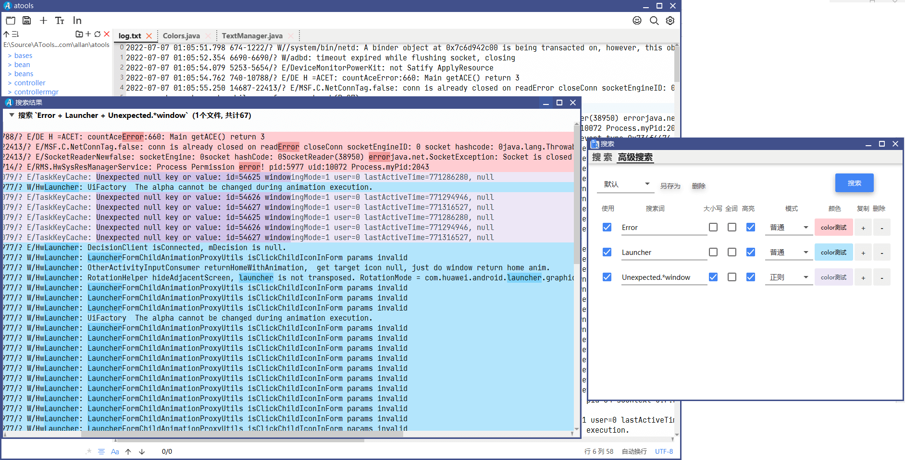
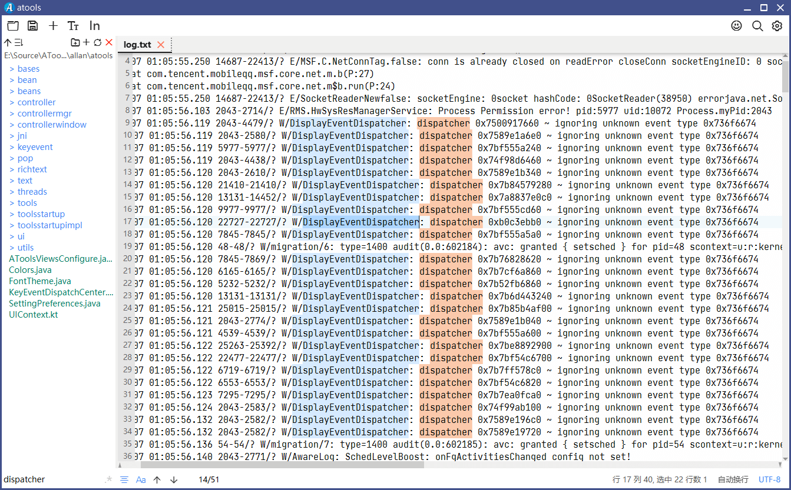
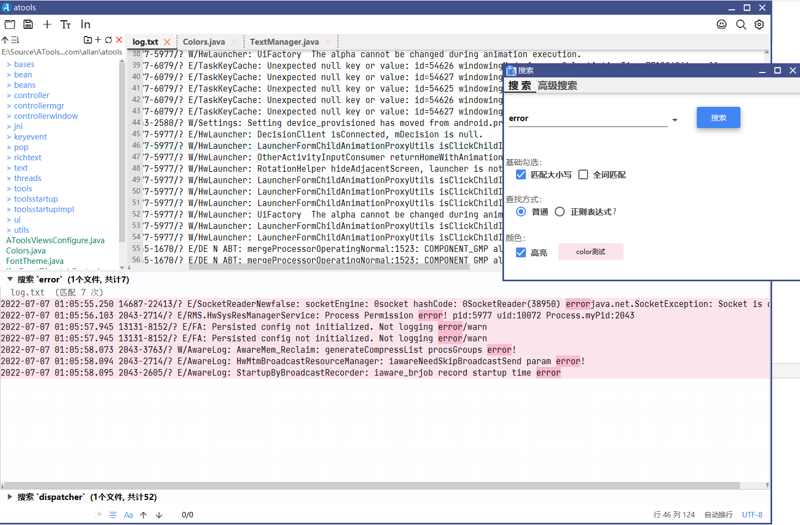
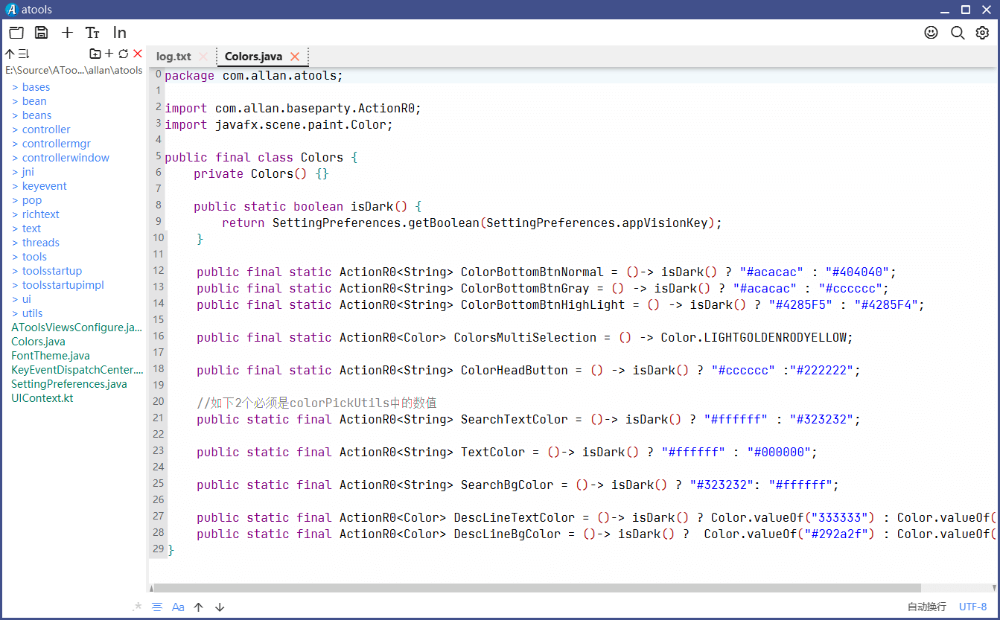

# Notepadmm

[English](readme_en.md)

[](https://www.oscs1024.com/project/jzlhll/Notepadmm?ref=badge_small)


Notepadmm 是一款面向大文本和日志分析的桌面编辑器，起因是 macOS 上缺少像 Notepad++ 一样方便的多行搜索工具。项目使用 JDK 17、JavaFX 21、Java、Kotlin、RichTextFX 和 JFoenix 开发，可在 Windows 与 macOS 上运行。

## 主要功能

- 多条件搜索着色：支持为不同关键字或正则表达式设置不同的背景色和文本色，便于快速分析日志。
- 常规搜索：支持正则表达式、区分大小写、全词匹配和最近 10 条搜索记录，搜索结果可拆分到独立窗口。
- 大文本浏览与编辑：支持自动换行、字体和字号调整、文本编码切换、插入空行等常用操作。
- 工作区：支持从左侧目录树浏览文件。
- 代码高亮和简单的图片预览。









## 命令行打开文件

macOS 支持在终端中直接打开文件：

```shell
# 通过 Launch Services 打开（应用未启动时会自动启动）
open -a ATools file.txt

# 直接执行应用内二进制，可一次打开多个文件
/Applications/ATools.app/Contents/MacOS/ATools file1.txt file2.md
```

若应用已在运行，后一次调用会把文件转发给运行中的实例打开，然后自动退出。也可以创建软链简化命令：

```shell
sudo ln -s /Applications/ATools.app/Contents/MacOS/ATools /usr/local/bin/atools
atools file.txt
```

## Gradle 任务

### 运行开发版

安装 JDK 17 后，在项目根目录执行：

```shell
./gradlew :app:run
```

Windows 使用：

```bat
gradlew.bat :app:run
```

`:app:run` 会编译 `BaseParty`、`BaseUiLibs` 和 `app`，组装模块路径与项目所需的 VM 参数，然后直接启动应用。它适合日常开发和调试，不会生成安装包。

### 生成发行包

首次打包前，将 `local.properties.example` 复制为 `local.properties`，并填写目标任务对应的 `packageJdk.*` JDK 路径。macOS 还需要准备代码签名证书，证书名称应与 `gradle.properties` 中的 `packageMacSigningKey` 一致。每次只能执行一个目标任务，且 macOS 任务只能在 macOS 上执行，Windows 任务只能在 Windows 上执行。

| Gradle 任务 | 作用 |
| --- | --- |
| `mainShAllMacArm64` | 准备 macOS Apple Silicon（ARM64）发行内容，并生成 `buildRoot/jpackageCmd.sh`。 |
| `mainShAllMacX64` | 准备 macOS Intel（x64）发行内容，并生成 `buildRoot/jpackageCmd.sh`。 |
| `mainShAllWindowsArm64` | 准备 Windows ARM64 发行内容，并生成安装版和绿色版 jpackage 脚本。目标 JDK 需要自带 Windows ARM64 JavaFX。 |
| `mainShAllWindowsX64` | 准备 Windows x64 发行内容，并生成安装版和绿色版 jpackage 脚本。 |

例如，在 Apple Silicon Mac 上执行：

```shell
./gradlew mainShAllMacArm64
./buildRoot/jpackageCmd.sh
```

在 Windows x64 上执行：

```bat
gradlew.bat mainShAllWindowsX64
buildRoot\jpackageCmdExe.bat
```

Windows 的 `jpackageCmdExe.bat` 生成 `.exe` 安装包，`jpackageCmdGreenExe.bat` 生成免安装应用目录；macOS 的 `jpackageCmd.sh` 生成 `.dmg`。最终产物统一输出到 `dist`。四个 `mainShAll...` 任务本身负责整理模块 JAR、第三方依赖和资源，分析并创建最小 JRE，混淆主应用 JAR，最后生成对应平台的 jpackage 脚本，不会直接执行该脚本。

项目已由 Gradle Wrapper 统一管理依赖、模块路径和运行参数，不需要手动配置旧版文档中的 Maven、module-path 或 VM 参数。新增三方库或项目模块时，参见 [编译注意事项](docs/编译注意事项.md)。

## 已知问题

- 文件关联仍有改进空间。
- Windows 打包工具仍存在一些限制；仅需常规文本编辑时，更推荐使用 Notepad++。
