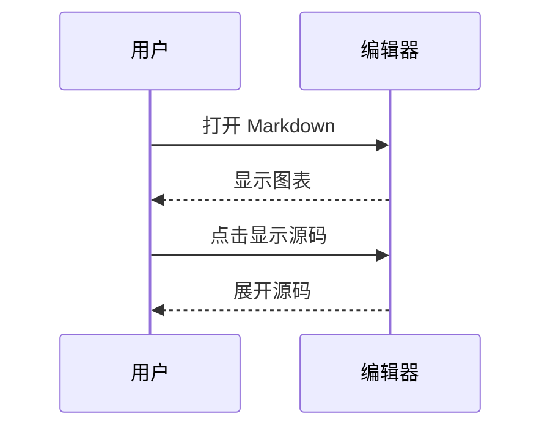

# Notepadmm

[English](readme_en.md)

[](https://www.oscs1024.com/project/jzlhll/Notepadmm?ref=badge_small)


**Notepadmm 是一款专业日志分析与 Markdown 编辑并重的桌面工具。** 从多条件搜索、分色追踪和结果定位，到带有大纲、图片、可编辑表格与离线图表的技术文档，帮助你在同一个工作区里完成问题排查与分析记录。

应用名称为 **ATools**，支持 Windows 与 macOS。项目基于 Java 17、Kotlin、JavaFX 21、RichTextFX 和 JFoenix，使用 Gradle 管理开发与发行打包。

## 专业日志分析

- **多条件搜索与分色追踪**：同时配置多个关键字或正则表达式，每个条件可独立启用、设置大小写与全词匹配，并指定背景色和文本色。用不同颜色区分错误、业务事件和请求标识，沿日志追踪同一条处理链路。
- **可复用的分析配置**：保存、切换和管理高级搜索方案，重复分析同类日志时直接使用已有条件。
- **搜索结果与原文联动**：集中展示命中行和匹配次数，点击结果定位原文；结果区可嵌入主窗口或放到独立窗口，便于对照上下文。
- **快速查找**：底部搜索支持上一个／下一个匹配与循环定位；双击字段后可继续查找相同文本。常规搜索支持正则、大小写、全词匹配和最近 10 条搜索记录。
- **日志阅读与整理**：支持行号、只读、自动换行、编码切换与 Alt 多选删除／替换，兼顾查看原始日志和整理文本片段。

典型用法：打开日志，为 `ERROR`、业务关键字和请求 ID 分别设置搜索条件与颜色，查看汇总结果并回到原文追踪上下文，再把结论整理到工作区中的 Markdown 文档。


## Markdown 编辑与阅读

打开 `.md` / `.markdown` 文件即可使用 Markdown 功能，在源码编辑的基础上提供样式与局部预览：

- **语法样式**：标题、引用、列表、粗体、斜体、删除线、链接和行内代码高亮；围栏代码块提供背景与部分语言的语法高亮。
- **当前文档大纲**：侧边栏按层级展示 ATX（`#`）和 Setext 标题，点击标题跳转到对应正文，编辑后自动更新。
- **图片预览**：独立成段的 Markdown 图片及 HTML `` 可直接显示在编辑区，支持本地相对路径、HTTP／HTTPS 图片与 `style="zoom:40%"` 缩放，宽图自动适应可视区域。
- **格式操作与完整预览**：支持粗体、斜体、六级标题等快捷键、可点击任务复选框与折叠详情；完整排版预览支持公式、脚注和目录，并提供 HTML 导出。支持范围与键位见 [Markdown 功能与操作](docs/Markdown.md)。
- **可编辑的 GFM 表格**：切换表格／源码显示，直接编辑单元格；支持增删、移动、复制行列，调整列对齐，以及主动优化源码排版。Tab／Shift+Tab 在单元格间导航，编辑操作支持撤销重做。
- **表格数据互通**：行、列和整表可复制为 Markdown 或 TSV；粘贴 TSV 时可覆盖多个单元格并按需扩充行列，方便与电子表格交换数据。
- **离线 Mermaid 图表**：内置流程图、时序图与甘特图渲染，可切换源码与图形，适合记录处理流程、调用关系和项目计划。
- **Typora 联动**：检测到本机安装 Typora 后，可通过菜单使用 Typora 打开支持的文档；当前编辑内容会先保存。

## 工作区与日常编辑

- 多标签编辑、拖入文件打开、最近文件及固定常用文件。
- 文件夹工作区、目录树浏览与文件／文件夹管理、最近工作区；侧边栏可切换工作区与当前文档信息。
- 会话快照与恢复：保留未保存内容和未命名文档，恢复标签顺序、活动文档与光标位置；退出时可选择自动保存文件。
- 源文件在磁盘上变化或被删除时，提供提示与重新加载、覆盖或另存为等处理入口。
- 明暗主题、字体与字号调整、Markdown 缩放，以及简体中文、繁体中文和英文界面。
- Java、Kotlin、C/C++、C#、XML 等语法高亮，以及图片查看、二进制查看和 JSON 格式化等辅助工具。


## Markdown 图表

在 `.md` / `.markdown` 文件中使用 `mermaid` 围栏代码块，支持 `flowchart`（含 `graph` 写法）、`sequenceDiagram` 和 `gantt`。完整代码块默认显示图形；鼠标悬停或选中图表区域时显示悬浮按钮，通过“显示源码”或“显示图形”切换。未闭合的代码块保留源码，语法错误会展开源码并在悬浮条中提示原因。切换显示方式不会修改文档内容。

图形模式支持拖选文字，再通过 `Cmd+C`（macOS）或 `Ctrl+C`（Windows）复制所选内容。点击节点不会自动复制。

流程图：


```mermaid
flowchart TD
    A[开始] --> B{是否通过?}
    B -->|是| C[完成]
    B -->|否| D[修改]
    D --> B
```

时序图：


```mermaid
sequenceDiagram
    participant U as 用户
    participant E as 编辑器
    U->>E: 打开 Markdown
    E-->>U: 显示图表
    U->>E: 点击显示源码
    E-->>U: 展开源码
```

甘特图：


```mermaid
gantt
    title 项目计划
    dateFormat YYYY-MM-DD
    section 开发
    设计 :done, design, 2026-10-01, 3d
    实现 :active, develop, after design, 5d
    section 发布
    验收 :review, after develop, 2d
    上线 :milestone, after review, 0d
```

## 命令行打开文件

macOS 支持在终端中直接打开文件：

```shell
# 通过 Launch Services 打开（应用未启动时会自动启动）
open -a ATools file.txt

# 直接执行应用内二进制，可一次打开多个文件
/Applications/ATools.app/Contents/MacOS/ATools file1.txt file2.md
```

若应用已在运行，后一次调用会把文件转发给运行中的实例打开，然后自动退出。也可以创建软链简化命令：

```shell
sudo ln -s /Applications/ATools.app/Contents/MacOS/ATools /usr/local/bin/atools
atools file.txt
```

## Gradle 任务

### 运行开发版

安装 JDK 17 后，在项目根目录执行：

```shell
./gradlew :app:run
```

Windows 使用：

```bat
gradlew.bat :app:run
```

`:app:run` 会编译 `BaseParty`、`BaseUiLibs` 和 `app`，组装模块路径与项目所需的 VM 参数，然后直接启动应用。它适合日常开发和调试，不会生成安装包。

### 生成发行包

首次打包前，将 `local.properties.example` 复制为 `local.properties`，并填写目标任务对应的 `packageJdk.*` JDK 路径。macOS 还需要准备代码签名证书，证书名称应与 `gradle.properties` 中的 `packageMacSigningKey` 一致。每次只能执行一个目标任务，且 macOS 任务只能在 macOS 上执行，Windows 任务只能在 Windows 上执行。

| Gradle 任务 | 作用 |
| --- | --- |
| `mainShAllMacArm64` | 准备 macOS Apple Silicon（ARM64）发行内容，并生成 `buildRoot/pack.sh`。 |
| `mainShAllMacX64` | 准备 macOS Intel（x64）发行内容，并生成 `buildRoot/pack.sh`。 |
| `mainShAllWindowsArm64` | 准备 Windows ARM64 发行内容，并生成安装版和绿色版 jpackage 脚本。目标 JDK 需要自带 Windows ARM64 JavaFX。 |
| `mainShAllWindowsX64` | 准备 Windows x64 发行内容，并生成安装版和绿色版 jpackage 脚本。 |

例如，在 Apple Silicon Mac 上执行：

```shell
./gradlew mainShAllMacArm64
./buildRoot/pack.sh
```

在 Windows x64 上执行：

```bat
gradlew.bat mainShAllWindowsX64
buildRoot\jpackageCmdExe.bat
```

Windows 的 `jpackageCmdExe.bat` 生成 `.exe` 安装包，`jpackageCmdGreenExe.bat` 生成免安装应用目录；macOS 的 `pack.sh` 生成 `.dmg`。最终产物统一输出到 `dist`。四个 `mainShAll...` 任务本身负责整理模块 JAR、第三方依赖和资源，分析并创建最小 JRE，混淆主应用 JAR，最后生成对应平台的 jpackage 脚本，不会直接执行该脚本。

Gradle Wrapper 统一管理依赖、模块路径和运行参数。新增三方库或项目模块时，参见 [编译注意事项](docs/编译注意事项.md)。

## 当前边界

- 日志分析以已打开文档的搜索、着色和结果定位为主，跨文件全文搜索尚未开放。
- Markdown 提供源码编辑、原生局部呈现与完整排版预览；公式、脚注、目录、图文混排和复杂列表／引用已接入编辑区内块预览，编辑时恢复源码；支持 HTML 导出，PDF／打印尚未实现。功能范围、快捷键和待办见 [Markdown 文档](docs/Markdown.md)。
- Mermaid 当前支持 `flowchart` / `graph`、`sequenceDiagram` 与 `gantt`。
- 大文档达到大小或行数限制时，会停用部分高亮、大纲和预览能力；具体体验取决于文档内容与本机资源。
