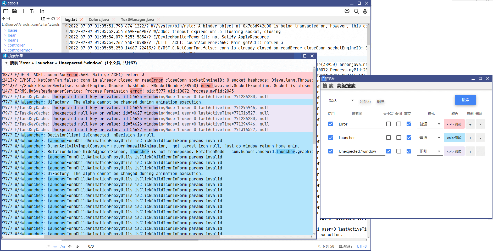
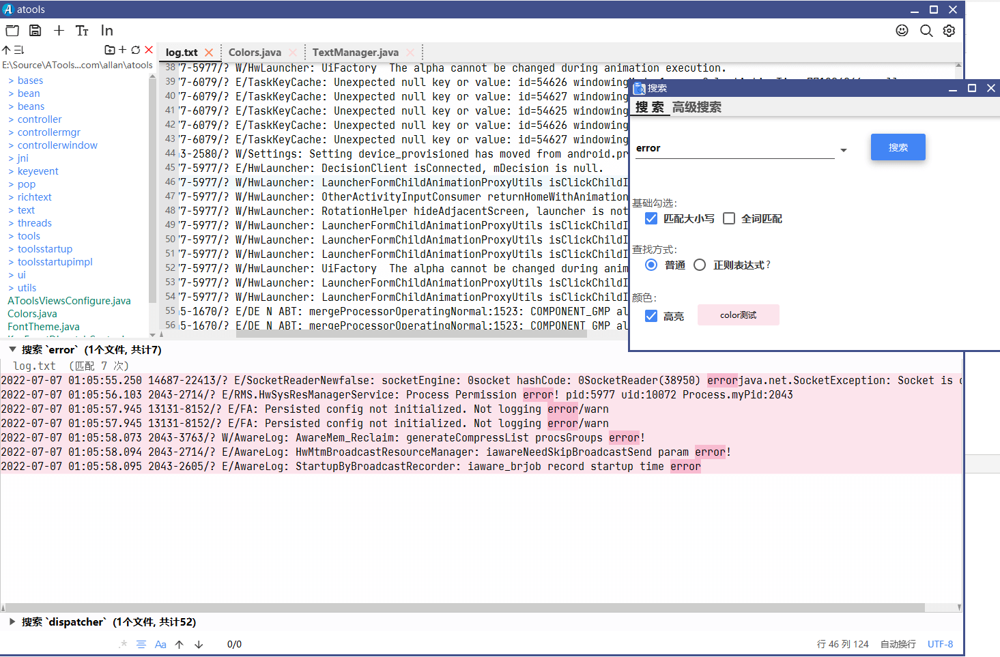
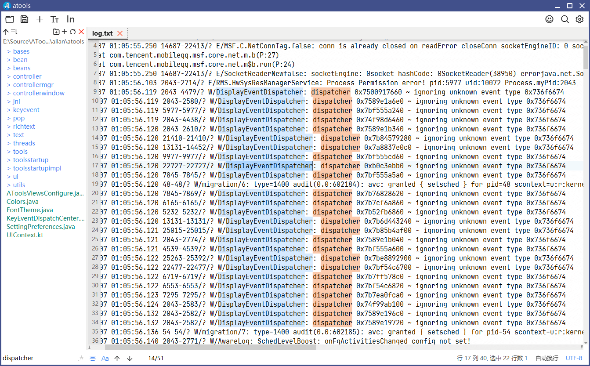
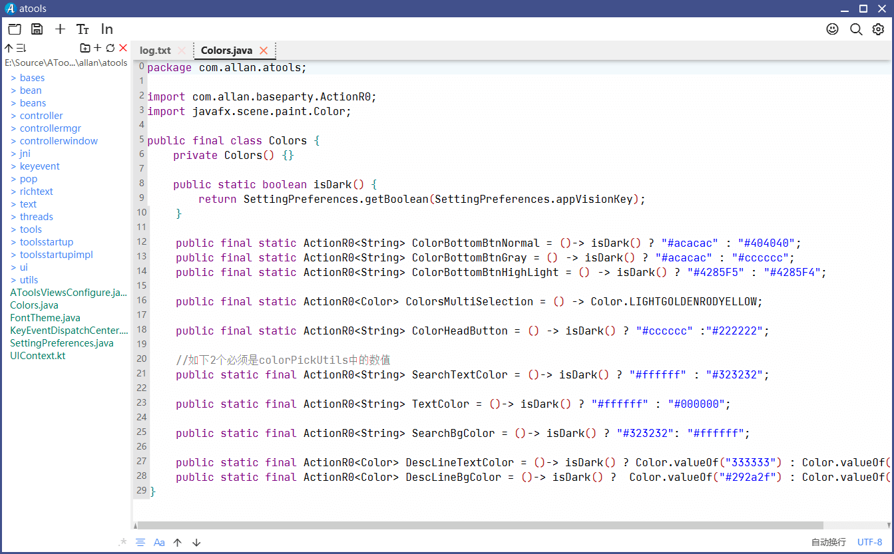
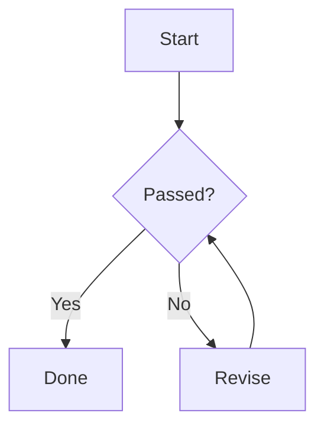
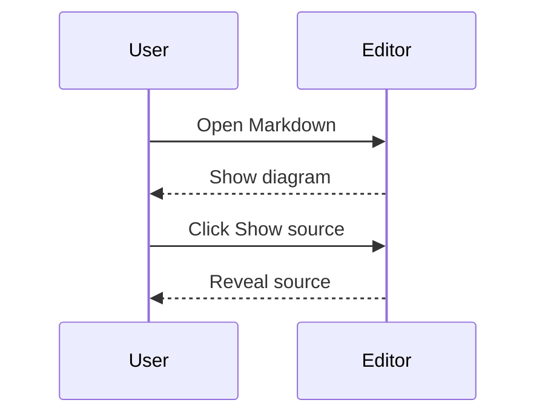

# Notepadmm

[中文](readme.md)

[](https://www.oscs1024.com/project/jzlhll/Notepadmm?ref=badge_small)


**Notepadmm is a desktop tool built equally for professional log analysis and Markdown editing.** Multi-pattern search, color-coded tracking, and linked results help you investigate problems, while outlines, images, editable tables, and offline diagrams help you document the findings in the same workspace.

The application is named **ATools** and supports Windows and macOS. It is built with Java 17, Kotlin, JavaFX 21, RichTextFX, and JFoenix, with Gradle managing development and distribution packaging.

## Professional log analysis

- **Multi-pattern search and color-coded tracking**: configure several keywords or regular expressions at once. Each condition has its own enabled state, case sensitivity, whole-word matching, background color, and text color. Distinguish errors, business events, and request identifiers as you trace a processing sequence.
- **Reusable analysis configurations**: save, switch, and manage advanced search profiles for repeated investigations of similar logs.
- **Results linked to the source**: collect matching lines and match counts, then click a result to locate the original text. Keep results in the main window or detach them into a separate window to compare context.
- **Quick navigation**: the bottom search bar supports previous/next matches and wraparound navigation; double-click a field to find other occurrences. Standard search supports regular expressions, case sensitivity, whole-word matching, and the 10 most recent searches.
- **Log reading and cleanup**: line numbers, read-only mode, word wrapping, encoding selection, and Alt multi-selection deletion/replacement support both raw-log inspection and text cleanup.

A typical workflow: open a log, assign separate conditions and colors to `ERROR`, business keywords, and a request ID, inspect the collected results and surrounding source, then record the findings in a Markdown document in your workspace.





## Markdown editing and reading

Open a `.md` / `.markdown` file to use Markdown styling and inline previews alongside source editing:

- **Syntax styling**: headings, block quotes, lists, bold, italics, strikethrough, links, and inline code. Fenced code blocks have a background and syntax highlighting for selected languages.
- **Document outline**: the sidebar lists `#`-style headings by level, updates as you edit, and lets you jump to a heading.
- **Image previews**: standalone Markdown images and HTML `` tags display directly in the editor. Relative paths and `style="zoom:40%"` scaling are supported; wide images fit the visible area.
- **Editable GFM tables**: switch between table and source views, edit cells directly, insert/delete/move rows and columns, duplicate data rows, change column alignment, and explicitly format table source. Tab/Shift+Tab navigate between cells; edits support undo and redo.
- **Table data exchange**: copy rows, columns, or entire tables as Markdown or TSV. Pasting TSV fills multiple cells and expands the table as needed for exchange with spreadsheets.
- **Offline Mermaid diagrams**: built-in flowchart and sequence-diagram rendering with source/diagram switching for documenting processes and interactions.
- **Typora integration**: when a local Typora installation is detected, menu actions can open supported documents in Typora after saving current edits.

## Workspaces and everyday editing

- Multiple editor tabs, drag-and-drop file opening, recent files, and pinned files.
- Folder workspaces, directory browsing and file/folder management, recent workspaces, and a sidebar that switches between the workspace and current-document information.
- Session snapshots and recovery for unsaved changes and untitled documents, including tab order, the active document, and caret positions. Files can optionally be saved automatically on exit.
- Prompts and actions for disk changes or deleted source files, including reload, overwrite, and save as.
- Light/dark themes, font and font-size settings, Markdown zoom, and Simplified Chinese, Traditional Chinese, and English interfaces.
- Syntax highlighting for Java, Kotlin, C/C++, C#, and XML, plus image viewing, binary viewing, and JSON formatting utilities.





## Markdown diagrams

Use a fenced `mermaid` block in a `.md` / `.markdown` file. Supported types are `flowchart` (including `graph`) and `sequenceDiagram`. Complete blocks display as diagrams by default. Hover over or select a diagram to access its floating toolbar, then choose **Show source** or **Show diagram**. Unclosed blocks keep their source visible; syntax errors reveal the source and show an error in the toolbar. Switching views does not change document content.

Select text in a diagram and press **Cmd+C** (macOS) or **Ctrl+C** (Windows) to copy it. Clicking a node does not copy it automatically.

Flowchart:


```mermaid
flowchart TD
    A[Start] --> B{Passed?}
    B -->|Yes| C[Done]
    B -->|No| D[Revise]
    D --> B
```

Sequence diagram:


```mermaid
sequenceDiagram
    participant U as User
    participant E as Editor
    U->>E: Open Markdown
    E-->>U: Show diagram
    U->>E: Click Show source
    E-->>U: Reveal source
```

## Open files from the command line

On macOS, files can be opened directly from the terminal:

```shell
# Open via Launch Services (launches the app if it is not running)
open -a ATools file.txt

# Run the bundled binary directly; multiple files are supported
/Applications/ATools.app/Contents/MacOS/ATools file1.txt file2.md
```

If the application is already running, the new invocation forwards the files to the running instance and then exits. You can also create a symlink to shorten the command:

```shell
sudo ln -s /Applications/ATools.app/Contents/MacOS/ATools /usr/local/bin/atools
atools file.txt
```

## Gradle tasks

### Run the development build

After installing JDK 17, run the following command from the project root:

```shell
./gradlew :app:run
```

On Windows, use:

```bat
gradlew.bat :app:run
```

`:app:run` compiles `BaseParty`, `BaseUiLibs`, and `app`, assembles the module path and required VM options, and launches the application directly. It is intended for development and debugging and does not create an installer.

### Create a distribution

Before packaging for the first time, copy `local.properties.example` to `local.properties` and set the `packageJdk.*` JDK path required by the selected target. macOS packaging also requires a code-signing certificate whose name matches `packageMacSigningKey` in `gradle.properties`. Run only one target task at a time. macOS targets can only be built on macOS, and Windows targets can only be built on Windows.

| Gradle task | Purpose |
| --- | --- |
| `mainShAllMacArm64` | Prepares a macOS Apple Silicon (ARM64) distribution and generates `buildRoot/pack.sh`. |
| `mainShAllMacX64` | Prepares a macOS Intel (x64) distribution and generates `buildRoot/pack.sh`. |
| `mainShAllWindowsArm64` | Prepares a Windows ARM64 distribution and generates installer and portable jpackage scripts. The target JDK must include Windows ARM64 JavaFX. |
| `mainShAllWindowsX64` | Prepares a Windows x64 distribution and generates installer and portable jpackage scripts. |

For example, on an Apple Silicon Mac:

```shell
./gradlew mainShAllMacArm64
./buildRoot/pack.sh
```

On Windows x64:

```bat
gradlew.bat mainShAllWindowsX64
buildRoot\jpackageCmdExe.bat
```

On Windows, `jpackageCmdExe.bat` creates an `.exe` installer, while `jpackageCmdGreenExe.bat` creates a portable application directory. On macOS, `pack.sh` creates a `.dmg`. All final artifacts are written to `dist`. The four `mainShAll...` tasks prepare the module JARs, third-party dependencies, and resources; analyze and create a minimal JRE; obfuscate the main application JAR; and generate the platform-specific jpackage scripts. They do not execute the generated scripts.

The Gradle Wrapper manages dependencies, the module path, and runtime options. When adding a third-party dependency or project module, see the [build notes](docs/编译注意事项.md).

## Current scope

- Log analysis focuses on search, highlighting, and result navigation within open documents. Cross-file full-text search is not yet available.
- Markdown combines source editing with inline previews. Full WYSIWYG editing of ordinary text, math, footnotes, and HTML/PDF export remain planned; see the [Markdown editing and preview plan](docs/TODO_Markdown成熟编辑与预览.md).
- Mermaid currently supports `flowchart` / `graph` and `sequenceDiagram`.
- Some highlighting, outline, and preview features are disabled when documents reach size or line-count limits. Performance depends on the document and available system resources.
