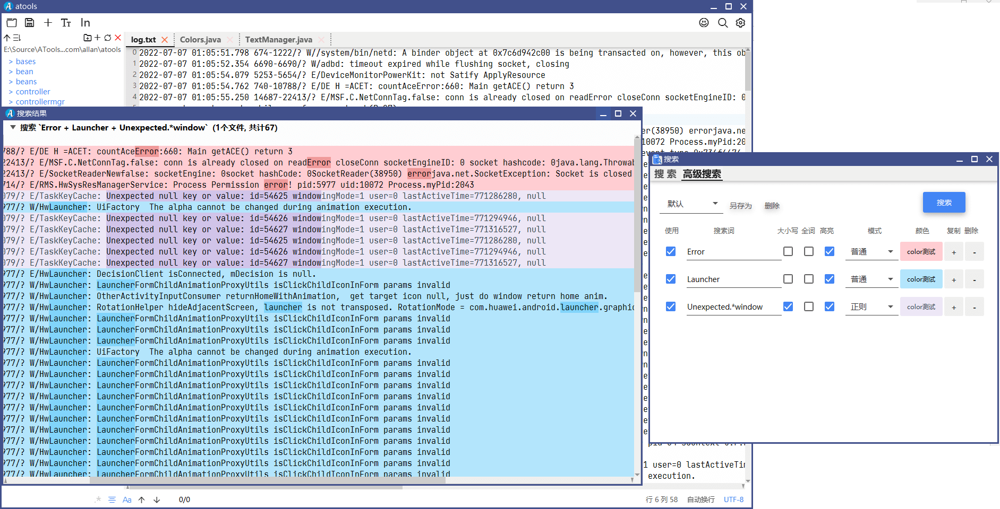

## Notepadmm

> Due to the lack of text-searching for multi-line function similar likes notepad++ on MAC.  So, I using javafx18 + JDK17 + richtextfx + jfoenix + kotlin and other open source software developed this project. It's called Notepad--. It can support the opening of large files.

The installation package is packaged with the latest JPackage. MAC software is only 38MB in size. Theory supports all common systems.

:smile: Supports Windows;

:smile: Supports MAC;

:smile: Supports Mac M1;

Theory support Linux system, currently need to recruit Linux developers, help me to compile.

### :revolving_hearts: the next generation of large file coloring log viewer text read/analysis software.

The current function status is available. Welcome to experience.

### The most recommended feature

:heart::heart::muscle:The most powerful function of this software is: multi-search coloring function, according to different keywords (can be regular), after set different background color and text color, it's quit easy to analysis log:

### General text feature
* Support left folder workspace browsing;

* Bottom search area (support regular, case, whole word matching); 

* Select the matching color and search the text color at the bottom;

* Insert blank lines;

* Adjust font size; Custom text area font; Automatic line feed switch; Text encoding format and other general functions.

* normal search

  * Save 10 past searches;
  * The bottom search record can be split into separate window;
  * Support case, full word matching, regular expression;
  * Support for searching text and whole line background colors;

  

* Code highlighting (not yet fully supported because the main purpose is text log analysis)

  
* Support picture preview.